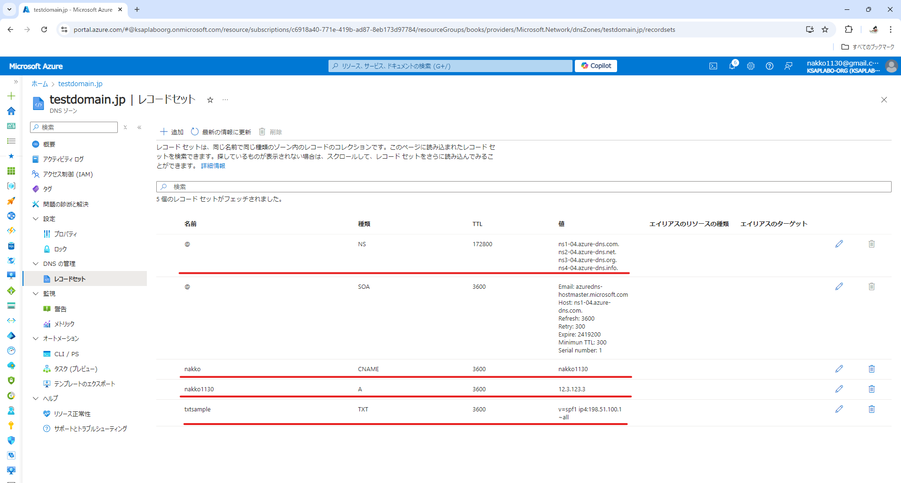

# AzureDNS-knowledge

## DNSの仕組み
### 前置き
Azure DNSを説明する前に前提知識として、「DNS」自体が何者であるか理解しておく必要があるので、以下で解説します。  
DNSの名前解決の仕組みや、DNSが何者であるかを理解している方は本章を読み飛ばしてOKです。

### DNSとは
DNSとは **Domain Name System** の略で「ドメイン名」と、「IPアドレス」を紐づけるためのサービスです。  
「google.com」や「yahoo.co.jp」などのサイトにアクセスするためのURLは、人間用に扱いやすくしたものであり、もともとの名前は「123.12.33.45」や「100.33.1.5」などのIPアドレスとなっています。  
ただし、最終的に処理を実行するのはコンピュータであるので、人間用の文字列から機械用の文字列に変換する必要があります。その役割を担ってくれているのが、**DNS**となっています。 

以下の様に、ユーザーとしては認識していませんが、内部的にはドメイン名とIPアドレスの変換が行われています。  
※以下の図のIPアドレスは説明のための適当なアドレスになります。  

この時のドメイン名からIPアドレスを求める行為を「**名前解決**」といいます。
ネットワークの話になると頻繫に出てくる用語です。

### 名前解決の仕組み
名前解決と一言でいうのは簡単ですが、DNS1台で変換の全てを行っているわけではありません。  
複数台のDNSサーバが組み合わさって実現できているので、その仕組みについても解説します。  

今回は、**nakko1130.jp**というサイトがあったと仮定します。この場合の名前解決は以下の手順で行われます。  

1. ルートDNSサーバに対して、名前解決のための問い合わせを行います。  
名前解決は末尾のドメインから問い合わせを進めていきます。  
ルートDNSサーバは、**nakko1130.jp**というサイトがどこにあるかわかっていませんが、URL末尾に記載されている**jp**というドメインに対応できるサーバがどこにあるか、ということは知っています。  
そのため、ルートDNSサーバは（**nakko1130.jp**）に対応できる**JP DNS Server**の場所を示します。（要するにたらい回しです。）

2. 1の手順と同様、JP DNSサーバに対して、名前解決のための問い合わせを行います。  
やはりJP DNSサーバも、**nakko1130.jp**というサイトがどこにあるかわかっていませんが、**nakko1130.jp**というドメインに対応できるサーバがどこにあるか、ということは知っています。  
そのため、JP DNSサーバは**jp**より前の問い合わせ（**nakko1130.**）に対応できる**NAKASE DNS Server**の場所を示します。（たらい回しpart2です。）

3. 1.2の手順と同様、NAKASE DNSサーバに対して名前解決のための問い合わせを行います。  
ただし、NAKASE DNSサーバは、**nakko1130.jp**というサイトがどこにあるか（どのIPアドレスに紐づいているか）知っているため、**nakko1130.jp** ＝ **29.133.63.2** というようにIPアドレスを教えてくれます。

4. 3で教えてもらったIPアドレスをもとに**nakko1130.jp**というサイトにアクセスします。これで名前解決が完了となります。

それぞれのサーバが知っている範囲で対応するのが、DNSの名前解決ということになります。  
上記の手順には記載していませんでしたが、各DNSサーバには、以下のようなDNSレコードというものが登録されています。（以下の表はあくまでも一例です。）

* ルートDNSサーバ

|ドメイン|種類|NS(ネームサーバーのドメイン又はIPアドレス)|
|---|---|---|
|com.|NS|ns1.dns.com|
|jp.|NS|ns2.dns.com|
|net.|NS|ns3.dns.com|

* JP DNSサーバ（ns2.dns.com）

|ドメイン|種類|NS(ネームサーバーのドメイン又はIPアドレス)|
|---|---|---|
|nakko1130.|NS|jp.ns1.dns.com|
|bookstation.|NS|jp.ns2.dns.com|

* NAKASE DNSサーバ（jp.ns1.dns.com）

|ドメイン|種類|NS(ネームサーバーのドメイン又はIPアドレス)|
|---|---|---|
|nakko1130.|A|29.133.63.2|

上記に示したレコードが存在することで、次に参照するべきDNSサーバが確立される。ということになります。

Azure DNSでは、以下のようにレコードが確認できます。

## よく使う（試験で出る）DNSレコード
前の章で名前解決の仕組みについて解説しました。  
ここからは、Az-104で特によく聞かれるDNSレコードについて説明していきます。  
※ちなみにAPの令和五年秋期の午後問題（ネットワーク）にもDNSレコードの問題が出てきています。~~（そんなもんだすな）~~

### DNSレコードとは
DNSサーバの構成要素の一つ。
* ○○というドメインで問い合わせが来た時に、△△に問い合わせをするよう指示する。  
* △△というドメインで問い合わせが来た時に、☆☆のIPアドレスを渡す。

のように、DNSサーバでの制御を定義するための要素になります。DNSレコードでよく使うものを以下に記載しています。

### DNSレコード一覧表
|種類|用途|例|
|---|---|---|
|A|IPv4のIPアドレスを割り当てるためのレコード。 最も一般的な形式で、ここに書いてあるドメインを使用してWebサイトにアクセスしています。|29.133.63.2|
|AAAA|IPv6のIPアドレスを割り当てるためのレコード。 IPアドレスの形式以外はAレコードと基本的に同じです。|2001:0db8:1235:5678:90ab:cdef:0000:0000|
|CNAME|Aレコードのエイリアスを作成するためのレコード。 **nakko**という名前のCNAMEレコードを作成し、参照先を**nakko1130**とすることで、どちらのドメインにアクセスしても、**29.133.63.2**に誘導されます。|Aレコードのドメイン|
|NS|次に参照するべきDNSサーバを設定するためのレコード。 「名前解決の仕組み」で登場したJP DNSサーバを例にすると、 **nakko1130.jp**で名前解決をするのであれば、jp.ns1.dns.comというDNSサーバに問い合わせてください。 という意味になります。|jp.ns1.dns.com|
|TXT|ドメインに関する追加情報を文字列で登録するためのレコード。 お名前.comでは右記のような、メールのなりすましを判別するための文字列が登録されるようです。|"v=spf1 ip4:198.51.100.1 ~all"|

## Azure DNS
ここまでの説明で、DNSの名前解決の仕組みとよく使われるDNSレコードについて説明しました。  
その前提知識をもとに、AzureDNSはどのように使われるのか、その他機能などを説明します。

### Azure Portal
コンソール上では、リソースが以下のように確認できます。

NSと、SOAのレコードについては、DNSの作成時にデフォルトで生成されるレコードとなっています。  
※デフォルトで生成されるNSと、SOAのレコードについては、削除することができません。  
@（自分自身を指すので、この場合はtestdomain.jp）への問い合わせは、ns1-04.azure-dns.com.、ns2-04.azxure-dns.net.、、が担当している。という風に読みます。  
他のレコードについても同様に、名前、値、種類を読めば、大体何を言っているか理解できると思います。

### パブリックDNSゾーン、プライベートDNSゾーン
Azureでは、インターネットからの問い合わせを解決するためのDNSサーバ（パブリックDNSゾーン）の他に、仮想ネットワーク内部及び仮想ネットワーク間の問い合わせを解決するためのDNSサーバ（プライベートDNSゾーン）を作成することができます。

以下の図の場合、緑の導線がプライベートDNSゾーンによって名前解決されることになります。  

なお、プライベートDNSゾーンは、**仮想ネットワークとの関連付け**を行うことで仮想ネットワーク内のVMがDNSを参照できるようになります。

### 二つの関連付け方法の違い
プライベートDNSゾーンと仮想ネットワークとの関連付けの際に、「**解決仮想ネットワーク**」と「**登録仮想ネットワーク**」のいずれかの関連付け方法を選択します。この二つの関連付け方法の違いは、レコードが動的に登録されるかどうかです。

**解決仮想ネットワーク**を選択した場合は、レコードが動的に登録されないため、**管理者が手動で登録・管理**する必要があります。

**登録仮想ネットワーク**を選択した場合は、その仮想ネットワークに接続する仮想マシンの**レコードを動的に登録**してくれます。そのため、管理のコストを軽減することができます。  
また、登録仮想ネットワークを選択した場合であっても、手動での追加・修正が可能です。

**※重要：仮想ネットワークとの関連付けは、プライベートDNSゾーンでのみ構成可能な機能です。  
パブリックDNSゾーンでは、レコードを動的に登録する機能はありません！！**
